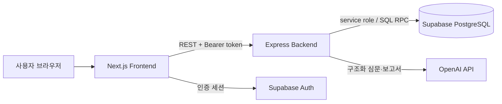

# 그 뜻이 아니예라

## 공통과제 II : 협업형 실전 산출물 제작 (2인 1팀)

한국 지역 사투리와 AI 자유 질문 심문을 결합한 웹 추리 게임입니다. 사용자는 사건의 증거와 용의자 진술을 비교해 간접 단서를 모으고 범인을 추리합니다.

## 팀원

| 이름 | GitHub | 역할 |
|---|---|---|
| 안소희 | `soheean1370` | 역할 세부 내용은 확인 필요 |
| 손기환 | `Kihwan819` | 역할 세부 내용은 확인 필요 |

## 선택 옵션

- [ ] 실시간 인터랙션
- [x] LLM Wrapper
- [ ] Cross-Platform

## 기획안

- **산출물 주제:** 사투리를 활용한 AI 심문 추리 게임
- **제작 목적:** 자유 질문과 지역어 대사를 통해 사건 정보를 수집하고, 서버가 검증한 단서로 추리를 완성하는 경험 제공
- **선택 옵션:** OpenAI API를 Express 서버에서 감싼 LLM Wrapper
- **핵심 구현 요소:**
  - Supabase Auth 기반 회원가입·로그인
  - 지역·에피소드·난이도별 게임 세션
  - 허용된 사건 정보만 사용하는 구조화 LLM 심문
  - 질문·증거·사실 사용 조건의 서버 단서 평가
  - 최종 추리, 엔딩, 점수와 사용자 진행도
- **사용 및 시연 시나리오:** 로그인 → 지역과 사건 선택 → 증거 열람 → 용의자 자유 심문 → 단서 확인 → 범인 지목 → 엔딩과 진행도 확인
- **팀원별 역할:** 저장소 이력으로 세부 분담을 확정할 수 없어 작성하지 않았습니다.

### 개발 일정

| 단계 | 목표 |
|---|---|
| 기획 | 사건·용의자·사투리 콘텐츠와 사용자 흐름 정의 |
| 기반 구현 | Next.js, Express, Supabase Auth·DB 구성 |
| 게임 구현 | 세션, 증거, 심문, 단서, 추리와 엔딩 연결 |
| 통합 | 실제 API 연동, UI·음원·게임 상태 통합 |
| 안정화 | 회귀 테스트, DB 정합성, 배포 전 문서 정리 |

## 구현 명세서

| 구현 요소 | 설명 | 우선순위 |
|---|---|---|
| 사용자 인증 | Supabase Auth 토큰으로 사용자와 설정을 관리 | 필수 |
| 지역·에피소드 선택 | 공개 사건과 난이도를 조회하고 세션을 생성 | 필수 |
| 사건 수사 | 세션에 제공된 증거를 열람하고 용의자를 선택 | 필수 |
| AI 심문 | 자유 질문을 분류하고 구조화된 사투리 답변을 생성 | 필수 |
| 단서 해금 | 증거·질문·용의자·fact 조건을 AND/OR로 평가 | 필수 |
| 최종 추리·엔딩 | 서버가 범인과 획득 단서를 판정해 결과를 반환 | 필수 |
| 진행도 | 플레이 이력, 최고 점수, 사투리 해금 정보를 제공 | 선택 |

상세 기능은 [기능 명세서](docs/functional-spec.md)를 참고합니다.

## 아키텍처



프론트는 화면과 입력을 담당합니다. 백엔드는 소유권, 질문 제한, 단서 조건, 점수와 엔딩을 검증하며 비공개 사건 정보와 서비스 키를 브라우저에 노출하지 않습니다.

## 설계 문서

### 화면 / 인터페이스 설계

| 화면 | 역할 |
|---|---|
| 홈·인증 | 게임 진입, 회원가입과 로그인 |
| 지역·에피소드 | 사건과 난이도 선택, 세션 시작 |
| 사건 수사 | 증거 열람, 용의자 선택, 남은 질문 확인 |
| 심문 | 자유 질문, 증거 제시, 사투리 답변과 새 단서 표시 |
| 사건 기록 | 증거·단서·증언·관계·타임라인과 메모 확인 |
| 최종 추리·결과 | 용의자 지목, 엔딩, 점수와 사건 진상 확인 |
| 프로필·설정 | 진행도, 이력, 사투리 기록, 음향과 텍스트 설정 |

상세 경로와 이동 조건은 [화면 설계서](docs/screen-design.md)를 참고합니다.

### 데이터 구조

- `public`: 사용자 프로필·설정, 세션, 심문 메시지, 획득 증거·단서, 결과와 진행도
- `game_content`: 지역, 사건, 용의자, 증거, 단서 조건, 사투리와 엔딩 콘텐츠
- `game_private`: 단서 평가 함수와 LLM 운영 로그 등 서버 전용 영역

단서 조건은 같은 `group_no` 안에서 AND, 그룹 간 OR로 평가합니다. `FACT_USED`는 최종 NPC 답변에 실제 반영된 fact를 `used_fact_refs`에서 확인합니다. 자세한 내용은 [DB 스키마 문서](docs/database-schema.md)를 참고합니다.

### API / 외부 서비스 연동

| 그룹 | 설명 | 인증 |
|---|---|---|
| 인증 | 가입, 로그인, 프로필과 설정 | 일부 필요 |
| 지역·에피소드 | 공개 지역·사건·난이도·용의자 조회 | 공개/선택 |
| 세션·증거 | 세션 생성·조회, 증거 열람 | 필요 |
| 심문·단서 | 자유 질문, 대화 이력, 획득 단서 조회 | 필요 |
| 추리·엔딩 | 최종 지목, 결과와 엔딩 보고서 | 필요 |
| 진행도 | 요약, 사건별 기록, 플레이 이력, 사투리 | 필요 |

외부 서비스는 Supabase Auth, Supabase PostgreSQL, OpenAI API를 사용합니다. 전체 경로는 [API 명세서](docs/api-spec.md)를 참고합니다.

## 산출물 및 실행 방법

### 요구 환경

- Node.js 22 이상
- pnpm 10.12.1
- 로컬 DB 재현 시 Docker Desktop과 Supabase CLI
- 유효한 Supabase 프로젝트와 OpenAI API 키

### 설치와 환경변수

```bash
pnpm install --frozen-lockfile
cp backend/.env.example backend/.env
cp frontend/.env.local.example frontend/.env.local
```

백엔드 환경변수:

```env
NODE_ENV=development
PORT=4000
CORS_ORIGIN=http://localhost:3000
OPENAI_API_KEY=
SUPABASE_URL=
SUPABASE_ANON_KEY=
SUPABASE_SERVICE_ROLE_KEY=
```

프론트 환경변수:

```env
NEXT_PUBLIC_API_BASE_URL=http://localhost:4000
NEXT_PUBLIC_SUPABASE_URL=
NEXT_PUBLIC_SUPABASE_ANON_KEY=
NEXT_PUBLIC_USE_MOCK_API=false
```

`SUPABASE_SERVICE_ROLE_KEY`와 `OPENAI_API_KEY`는 백엔드에만 둡니다. 실제 환경변수 파일은 커밋하지 않습니다.

### 로컬 DB와 콘텐츠

```bash
cd backend
supabase start
supabase db reset
pnpm seed:content
```

`supabase db reset`은 빈 로컬 DB에만 사용합니다. 운영 DB에는 절대 실행하지 않습니다. 단서 조건 그래프는 migration이 관리하고, 콘텐츠 seed는 해당 테이블을 덮어쓰지 않으므로 반복 실행해도 배포 조건이 중복되지 않습니다.

### 실행·검증

```bash
pnpm dev
pnpm lint
pnpm test
pnpm build
```

- Frontend: `http://localhost:3000`
- Backend: `http://localhost:4000`
- Health check: `http://localhost:4000/health`

CI는 `main`, `dev`의 push와 PR에서 install, lint, test, build를 실행합니다. 단위 테스트는 실제 OpenAI 비용을 발생시키지 않습니다.

### 기술 구성

| 분류 | 사용 기술 |
|---|---|
| Frontend | Next.js 15, React 19, TypeScript, Tailwind CSS |
| Backend | Express, TypeScript, Zod |
| Data/Auth | Supabase Auth, PostgreSQL, RLS, SQL RPC |
| LLM | OpenAI API structured outputs |
| 품질 | Vitest, ESLint, GitHub Actions, pnpm workspace |

## 회고 문서

### Keep — 잘 된 점, 다음에도 유지할 것

- UI와 서버 책임을 분리하고 판정·비공개 정보는 서버에서 관리했습니다.
- 단서 조건을 데이터 기반 AND/OR 규칙으로 구성해 사건별 확장이 가능합니다.
- migration 이력과 외부 호출 없는 회귀 테스트로 변경을 재현할 수 있습니다.

### Problem — 아쉬웠던 점, 개선이 필요한 것

- LLM의 `revealedFacts` 해석과 실제 단서 조건이 어긋나 진행 단서가 열리지 않았습니다.
- 로컬 Supabase 전체 재현은 Docker 환경에 의존합니다.
- 팀 역할과 개인 회고를 확정할 근거 문서가 없습니다.

### Try — 다음번에 시도해볼 것

- 별도 테스트 Supabase에서 세션 생성부터 엔딩까지 자동 E2E를 운영합니다.
- 구조화 응답 품질과 단서 해금률을 익명 지표로 관찰합니다.
- 콘텐츠 조건의 변경 책임과 검수 절차를 기획 단계부터 명시합니다.

### 팀원별 소감

**안소희:** 확인 가능한 기존 소감이 없어 비워 둡니다.

**손기환:** 확인 가능한 기존 소감이 없어 비워 둡니다.

## 브랜치와 운영 원칙

- `main`: 배포 기준. 검증된 `dev`만 fast-forward로 승격합니다.
- `dev`: 다음 배포 후보 통합 브랜치입니다.
- `feat/*`, `fix/*`, `chore/*`: 최신 `dev`에서 분기합니다.
- 운영 migration 전에는 백업, 프로젝트 ref, 미적용 이력을 확인합니다.
- 현재 `LICENSE`가 비어 있어 배포 전 라이선스 결정이 필요합니다.
