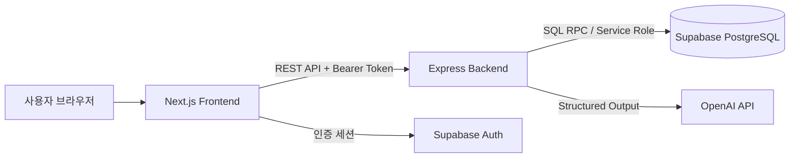

# 26s-w2-c3-07

## 공통과제 II : 협업형 실전 산출물 제작 (2인 1팀)

**프로젝트명:** 형사님, 그 뜻이 아니예라

**목적:** 실시간 인터랙션, LLM Wrapper, Cross-Platform 중 하나의 옵션을 선택해 구현하며, 선택한 기술을 실제로 동작하는 형태의 산출물로 완성한다.

**선택 옵션:**

| 옵션 | 설명 |
|---|---|
| 실시간 인터랙션 | 사용자 간 상태 변화, 실시간 데이터 흐름, 스트리밍 응답 등 실시간성이 드러나는 기능을 구현 |
| LLM Wrapper | LLM API를 활용하여 AI 기능이 포함된 산출물을 구현 |
| Cross-Platform | 하나의 산출물을 여러 실행 환경에서 사용할 수 있도록 구현 |

**결과물:** 지역 사투리와 AI 자유 질문 심문을 결합한 웹 추리 게임, 실행 가능한 코드와 핵심 설계 문서

> 사투리를 대사에 입히는 양념이 아니라, 오해와 진의를 구분하며 사건을 풀어가는 추리의 재료로 만든 프로젝트입니다.

---

## 팀원

| 이름 | 학교 | GitHub | 역할 |
|---|---|---|---|
| 안소희 | 부산대학교 | `soheean1370` | 공동 기획, 사건·사투리 콘텐츠 구성, 화면 기획 및 프론트엔드 구현 |
| 손기환 | KAIST | `Kihwan819` | 공동 기획, 프론트엔드·백엔드 구현, API·DB 통합 및 배포 안정화 |

---

## 선택 옵션

- [ ] 실시간 인터랙션
- [x] LLM Wrapper
- [ ] Cross-Platform

Express 백엔드가 OpenAI API를 감싸고, 용의자 성격·관계·허용된 사건 정보·사투리 규칙을 구조화해 전달합니다. 생성 결과는 JSON Schema와 서버 검증을 거친 뒤 게임 상태에 반영됩니다.

---

## 기획안

- **산출물 주제:** 사투리를 추리 단서로 활용하는 AI 심문 게임
- **제작 목적:** 지역어가 가진 맥락과 중의성을 플레이어가 해석하고, 증거와 진술을 종합해 범인을 추리하는 경험 제공
- **선택 옵션:** OpenAI API 기반 LLM Wrapper
- **핵심 구현 요소:**
  - 지역별 사건과 사투리 표현을 결합한 에피소드 콘텐츠
  - 자유 질문을 분류하고 허용된 정보만 사용하는 AI 용의자 심문
  - 증거 열람·제시, 질문 유형, 용의자, fact 사용을 조합한 단서 해금
  - 난이도별 질문 제한과 감정 상태를 포함한 서버 게임 세션
  - 최종 추리, 정답·오답 엔딩, 점수와 사용자 진행도
- **사용 / 시연 시나리오:** 로그인 → 지역과 사건 선택 → 난이도 선택 → 증거 열람 → 용의자 자유 심문 → 사투리 진술과 간접 단서 해석 → 범인 지목 → 엔딩과 점수 확인
- **팀원별 역할:** 두 팀원이 기획과 통합 검수에 함께 참여하고, 콘텐츠·화면 구성과 서버·DB 통합을 중심으로 역할을 나누어 진행

### 개발 일정

| 날짜 | 목표 |
|---|---|
| Day 1 | 주제 선정, 핵심 게임 흐름과 지역별 사건 기획 |
| Day 2 | 화면 구조, DB 스키마, API 계약 설계 |
| Day 3 | 인증, 지역·에피소드, 세션 기능 구현 |
| Day 4 | 증거·용의자·심문 UI와 LLM Wrapper 구현 |
| Day 5 | 단서 조건, 사건 기록, 최종 추리와 엔딩 연결 |
| Day 6 | 이미지·음원·사투리 콘텐츠 보완 및 프론트·백엔드 통합 |
| Day 7 | 전체 흐름 검증, 오류 수정, 배포와 문서 정리 |

---

## 구현 명세서

| 구현 요소 | 설명 | 우선순위 |
|---|---|---|
| 사용자 인증·설정 | Supabase Auth 기반 가입·로그인과 닉네임, BGM, 효과음, 텍스트 속도 관리 | 필수 |
| 지역·에피소드 선택 | 공개 사건, 용의자 정보, 난이도를 조회하고 게임 세션 생성 | 필수 |
| 사건 수사 | 세션에 제공된 증거를 열람하고 용의자를 선택 | 필수 |
| AI 자유 심문 | 질문을 분류하고 캐릭터·사건 정보에 맞는 구조화 사투리 답변 생성 | 필수 |
| 단서 해금 | 질문·용의자·증거·fact 조건을 서버에서 AND/OR로 평가 | 필수 |
| 최종 추리·엔딩 | 서버가 범인, 획득 단서, 해결도를 판정해 점수와 엔딩 반환 | 필수 |
| 사건 기록 | 증거, 단서, 증언, 타임라인, 관계와 사용자 메모 제공 | 선택 |
| 진행도·사투리 기록집 | 플레이 이력, 최고 점수와 해금한 사투리 표현 제공 | 선택 |

상세 요구사항은 [기능 명세서](docs/functional-spec.md)에서 확인할 수 있습니다.

---

## 아키텍처



- 프론트엔드는 화면, 입력, 음향과 사용자 상호작용을 담당합니다.
- 백엔드는 인증된 세션 소유권, 질문 제한, 단서 조건, 점수와 엔딩을 검증합니다.
- Supabase는 인증, 공개 게임 콘텐츠와 사용자별 게임 상태를 저장합니다.
- OpenAI API에는 서버가 허용한 사건 정보만 전달하며, 응답은 JSON Schema와 Zod로 검증합니다.

---

## 설계 문서

### 화면 / 인터페이스 설계

| 화면 | 목적 | 주요 행동 |
|---|---|---|
| 홈 | 게임과 기록 메뉴 진입 | 수사 시작, 기록·사투리 기록집 열기 |
| 로그인·회원가입 | 사용자 인증 | 계정 생성, 로그인 |
| 지역·에피소드 | 사건과 난이도 선택 | 사건 상세 확인, 세션 시작 |
| 사건 수사 | 현재 수사 상태 확인 | 증거 열람, 용의자 선택, 추리 진입 |
| 심문 | AI 용의자와 자유 대화 | 질문 입력, 증거 제시, 답변·감정·새 단서 확인 |
| 사건 기록 | 수집한 정보 정리 | 증거·단서·증언·관계·타임라인·메모 확인 |
| 최종 추리 | 범인 지목 | 용의자 선택 후 최종 제출 |
| 엔딩 | 수사 결과 확인 | 정답·오답 엔딩, 점수와 사건 진상 확인 |
| 프로필·설정 | 사용자 기록 관리 | 진행도·이력·사투리·음향 설정 확인 |

상세 화면 경로와 이동 조건은 [화면 설계서](docs/screen-design.md)를 참고합니다.

### 데이터 구조

| 스키마 / 테이블 | 역할 |
|---|---|
| `public.profiles`, `user_settings` | 사용자 프로필과 게임 설정 |
| `public.game_sessions` | 난이도, 남은 질문, 현재 상태를 포함한 플레이 세션 |
| `public.interrogation_messages` | 질문, NPC 답변, 감정과 fact 사용 기록 |
| `public.session_evidence`, `session_clues` | 세션별 증거 열람과 단서 획득 기록 |
| `public.game_results`, `user_episode_progress` | 최종 추리 결과, 점수와 사건별 진행도 |
| `game_content.*` | 지역, 사건, 인물, 증거, 단서 조건, 사투리와 엔딩 콘텐츠 |
| `game_private.*` | 단서 평가 함수와 LLM 운영 로그 등 서버 전용 데이터 |

단서 조건은 같은 `group_no` 안에서 AND, 서로 다른 그룹 사이에서 OR로 평가합니다. 자세한 관계와 권한 원칙은 [DB 스키마 문서](docs/database-schema.md)를 참고합니다.

### API / 외부 서비스 연동

| Method / 방식 | Endpoint / 서비스 | 설명 | 요청 | 응답 | 비고 |
|---|---|---|---|---|---|
| REST | `/api/auth/*` | 가입, 로그인, 프로필과 설정 | 사용자 인증 정보 | 세션·프로필·설정 | 일부 인증 필요 |
| REST | `/api/regions`, `/api/episodes/*` | 지역·사건·난이도·용의자 조회 | 지역 또는 사건 식별자 | 공개 사건 정보 | 공개 API |
| REST | `/api/sessions/*` | 세션 생성·조회와 상태 변경 | 사건, 난이도, 세션 식별자 | 서버 게임 상태 | 인증 필요 |
| REST | `/api/sessions/:id/evidence`, `/clues` | 증거 열람과 획득 단서 조회 | 세션·증거 식별자 | 증거, 단서, 신규 해금 | 인증 필요 |
| REST | `/api/sessions/:id/interrogations` | AI 심문 생성과 이력 조회 | 질문, 용의자, 제시 증거 | NPC 답변, 감정, 신규 단서 | 인증 필요 |
| REST | `/api/sessions/:id/deduction`, `/ending` | 최종 판정과 엔딩 | 지목한 용의자 | 정답 여부, 점수, 엔딩 | 인증 필요 |
| SDK | Supabase Auth | 이메일·비밀번호 인증 | 계정 정보 | access token | 외부 서비스 |
| SQL/RPC | Supabase PostgreSQL | 콘텐츠와 게임 상태 저장, 원자적 판정 | 서버 검증 데이터 | 저장 결과 | 외부 서비스 |
| JSON Schema | OpenAI API | 사투리 심문 답변과 선택적 보고서 생성 | 허용된 캐릭터·사건 맥락 | 구조화 응답 | 서버에서만 호출 |

전체 endpoint는 [API 명세서](docs/api-spec.md)를 참고합니다.

---

## 산출물 및 실행 방법

- **산출물 설명:** Next.js 프론트엔드와 Express 백엔드로 구성된 AI 사투리 추리 웹 게임
- **실행 환경:** Node.js 22 이상, pnpm 10.12.1, Supabase, OpenAI API
- **실행 방법:** 환경변수 설정 후 루트에서 `pnpm dev`
- **시연 영상 / 이미지:** 프로젝트 제출 자료에 별도 첨부

### 실행 방법

```bash
# 의존성 설치
pnpm install --frozen-lockfile

# 환경변수 파일 준비
cp backend/.env.example backend/.env
cp frontend/.env.local.example frontend/.env.local

# 프론트엔드와 백엔드 동시 실행
pnpm dev

# 품질 검증
pnpm lint
pnpm test
pnpm build
```

로컬 Supabase를 처음 구성할 때만 다음 명령을 사용합니다.

```bash
cd backend
supabase start
supabase db reset
pnpm seed:content
```

> `supabase db reset`은 빈 로컬 DB에만 사용하며 운영 DB에는 실행하지 않습니다. 실제 API 키와 service-role key는 저장소에 커밋하지 않습니다.

### 필수 환경변수

백엔드 `backend/.env`:

```env
NODE_ENV=development
PORT=4000
CORS_ORIGIN=http://localhost:3000
OPENAI_API_KEY=
SUPABASE_URL=
SUPABASE_ANON_KEY=
SUPABASE_SERVICE_ROLE_KEY=
```

프론트엔드 `frontend/.env.local`:

```env
NEXT_PUBLIC_API_BASE_URL=http://localhost:4000
NEXT_PUBLIC_SUPABASE_URL=
NEXT_PUBLIC_SUPABASE_ANON_KEY=
NEXT_PUBLIC_USE_MOCK_API=false
```

### 기술 구성

| 분류 | 사용 기술 |
|---|---|
| 핵심 기술 | OpenAI API Structured Outputs, LLM Wrapper |
| 프론트엔드 | Next.js 15, React 19, TypeScript, Tailwind CSS |
| 백엔드 | Express, TypeScript, Zod |
| 데이터 저장·인증 | Supabase PostgreSQL, Supabase Auth, RLS, SQL RPC |
| 테스트·협업 | Vitest, ESLint, pnpm workspace, GitHub Actions |
| 배포 | Vercel |

---

## 회고 문서

> [KPT 방법론 참고](https://velog.io/@habwa/%EB%8B%A8%EA%B8%B0-%ED%94%84%EB%A1%9C%EC%A0%9D%ED%8A%B8-%ED%9A%8C%EA%B3%A0-KPT-%EB%B0%A9%EB%B2%95%EB%A1%A0)

### Keep — 잘 된 점, 다음에도 유지할 것

- 사투리를 분위기 표현에 그치지 않고, 말의 진의와 회피를 해석하는 실제 추리 장치로 설계한 점
- LLM이 비공개 정보나 임의의 설정을 만들지 않도록 허용 fact, 구조화 응답과 서버 검증을 분리한 점
- 사건 문구, 인물, 이미지, 음향과 단서 조건을 반복 검수하며 전체 스토리의 일관성을 높인 점

### Problem — 아쉬웠던 점, 개선이 필요한 것

- 이미지 생성 요청이 추상적이면 사건과 무관한 지명·문구가 만들어지거나 여러 인물의 얼굴과 특징이 뒤섞이는 문제가 있었습니다.
- 짧은 일정에 기획, 콘텐츠 제작, 프론트·백엔드 통합을 함께 진행하면서 작은 문구와 데이터 조건을 놓치기 쉬웠습니다.
- LLM의 `revealedFacts` 해석과 서버 단서 조건이 한때 어긋나, NPC가 사실을 말해도 진행 단서가 열리지 않는 문제가 있었습니다.

### Try — 다음번에 시도해볼 것

- 현재 웹 서비스를 모바일·데스크톱에서도 자연스럽게 사용할 수 있는 앱으로 확장해 Cross-Platform 경험을 구현하고 싶습니다.
- TTS를 연동해 지역별 억양과 감정 변화를 살린 사투리 음성 심문을 지원하고 싶습니다.
- 이미지 생성용 인물·장소·소품 프롬프트 템플릿을 만들어 사건 전반의 시각적 일관성을 더 안정적으로 유지하고 싶습니다.
- 별도 테스트 환경에서 세션 생성부터 심문, 단서 해금과 엔딩까지 자동화된 E2E 검증을 운영하고 싶습니다.

### 팀원별 소감

**안소희:**

> 사투리가 단순한 지역색이 아니라 말의 표면과 진의를 해석하는 추리 단서가 될 수 있다는 점이 가장 인상 깊었습니다. AI 이미지를 제작할 때도 문구, 지명, 인물과 소품의 특징을 구체적으로 전달해야 스토리에 맞는 결과를 얻을 수 있었습니다. 사투리 대사와 시각 자료를 함께 다듬으며, AI 활용의 완성도는 필요한 맥락을 얼마나 명확하게 전달하고 작은 어긋남을 끝까지 수정하는지에 달려 있다는 것을 배웠습니다.

**손기환:**

> 처음에는 사투리 음성을 듣고 발음과 억양으로 대결하는 게임을 기획했지만, 음성 인식과 지역별 억양을 안정적으로 구현하기 어려워 텍스트 기반 추리 게임으로 방향을 전환했습니다. 백엔드가 DB의 인물·사건·사투리 정보를 프롬프트로 구성해 LLM에 전달하고 답변을 생성하도록 구현했지만, 결과가 지역 고유 단어보다 종결 어미 중심으로 표현되는 경우가 많았습니다. 목표한 수준의 풍부한 사투리를 완전히 구현하지 못한 점은 아쉬웠으며, 앞으로 음성 지원과 표현 다양성을 보완해 보고 싶습니다.

---

## 참고 자료

### 프로젝트 문서

- [기능 명세서](docs/functional-spec.md)
- [DB 스키마 문서](docs/database-schema.md)
- [화면 설계서](docs/screen-design.md)
- [API 명세서](docs/api-spec.md)

### 주요 기술

- [OpenAI API Documentation](https://platform.openai.com/docs/)
- [Next.js Documentation](https://nextjs.org/docs)
- [Supabase Documentation](https://supabase.com/docs)
- [Express Documentation](https://expressjs.com/)
- [Zod Documentation](https://zod.dev/)
