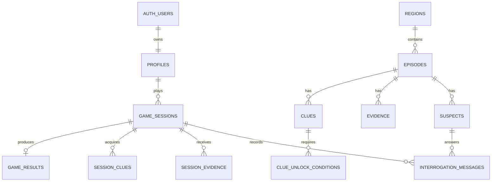

# DB 스키마 문서

## 1. 스키마 구분

| 스키마 | 역할 | 접근 원칙 |
|---|---|---|
| `public` | 사용자별 런타임 상태와 결과 | RLS와 소유권 검증 적용 |
| `game_content` | 지역·사건·용의자·증거·단서·엔딩 콘텐츠 | 서버 관리, 클라이언트 직접 쓰기 금지 |
| `game_private` | 평가 함수와 LLM 운영 로그 | Data API 비공개, service-role 전용 |

## 2. 핵심 테이블

| 테이블 | 역할 | 주요 키·상태와 관계 |
|---|---|---|
| `profiles` | 사용자 프로필 | PK가 `auth.users.id` 참조 |
| `user_settings` | 음향·텍스트 설정 | `user_id → profiles` |
| `game_sessions` | 플레이 세션 | 사용자, 에피소드, 난이도; `status`, `remaining_questions` |
| `session_suspect_states` | 세션별 용의자 상태 | 세션·용의자; 감정, 질문 횟수 |
| `interrogation_messages` | 질문과 NPC 답변 | 세션·용의자; fact·제시 증거 JSON 배열 |
| `session_evidence` | 세션에 제공된 증거 | 세션·증거 unique, `viewed_at` |
| `session_clues` | 획득한 단서 | 세션·단서 unique, 획득 출처·시각 |
| `session_notes` | 사용자 메모 | 세션, 선택적 용의자 참조 |
| `game_results` | 최종 지목과 판정 | 세션당 1건, 선택 용의자·엔딩·점수 |
| `user_episode_progress` | 사건별 진행도 | 사용자·에피소드 unique |
| `user_dialect_unlocks` | 해금한 사투리 | 사용자·표현 unique |
| `regions`, `episodes` | 지역과 공개 사건 | 지역 1:N 에피소드 |
| `suspects`, `victims` | 사건 인물 | 에피소드 소속과 범인 FK 무결성 |
| `evidence`, `clues` | 증거와 간접 단서 | 에피소드 소속 |
| `clue_unlock_conditions` | 데이터 기반 해금 조건 | 단서, 그룹, 순서 unique |
| `difficulty_initial_*` | 난이도별 시작 자료 | 난이도 설정과 증거·단서 연결 |
| `clue_evidence_unlocks` | 단서가 추가 증거를 해금 | 단서·증거 연결 |
| `suspect_facts`, `suspect_lies` | LLM 허용 지식과 주장 | 용의자별 서버 콘텐츠 |
| `endings` | 정답·오답 고정 엔딩 | 에피소드와 선택 용의자 연결 |
| `llm_request_logs` | LLM 요청 운영 정보 | 세션·심문 메시지 참조, 원문 프롬프트 미저장 |

## 3. 주요 관계

## 4. 단서 해금 구조

`clue_unlock_conditions`는 `clue_id`, `group_no`, `condition_order`, `condition_type`, `target_ref`, `operator`, `expected_value`를 핵심 값으로 사용한다.

- 그룹 내부: `bool_and`로 AND 평가
- 그룹 사이: 하나 이상의 완성 그룹이 있으면 OR 해금
- `FACT_USED`: 세션의 `interrogation_messages.used_fact_refs` 누적 검사
- `FACT_REVEALED`: `revealed_fact_refs` 누적 검사
- `CLAIM_RECORDED`: `claimed_fact_refs` 누적 검사
- `EVIDENCE_PRESENTED`, `QUESTION_TYPE_ASKED`, `SUSPECT_INTERROGATED`: 심문 직후에는 현재 메시지, 세션 새로고침 재평가에서는 전체 메시지 검사
- `session_clues(session_id, clue_id)` unique와 `ON CONFLICT DO NOTHING`으로 멱등성 보장

평가 함수는 service-role만 실행하며 API가 먼저 사용자 세션 소유권을 확인한다.

## 5. RLS와 서버 권한

- `public` 사용자 데이터는 RLS와 인증 사용자 소유권 정책을 적용한다.
- 콘텐츠와 비공개 스키마의 직접 클라이언트 쓰기 권한은 부여하지 않는다.
- `SECURITY DEFINER` 함수는 빈 `search_path`와 완전 수식 테이블명을 사용한다.
- 서비스 키는 백엔드 환경변수로만 관리한다.

콘텐츠 테이블의 RLS 활성화·정책 없음 항목은 서버 전용 차단 구조에서 발생하는 Supabase 정보성 권고다. Auth의 유출 비밀번호 보호 활성화 여부는 별도 운영 설정으로 관리한다.

## 6. migration과 seed

- 적용된 migration은 수정하지 않고 `backend/supabase/migrations`에 새 보정 migration을 추가한다.
- 빈 로컬 DB는 `supabase db reset`으로 전체 이력을 재현한다. 운영 DB에는 reset을 사용하지 않는다.
- `pnpm seed:content`는 안정적인 `code` 또는 `id`로 콘텐츠를 upsert한다.
- 완전한 단서 조건 그래프는 migration이 소유한다. seed는 콘텐츠 유효성 검사에는 조건을 사용하지만 `clue_unlock_conditions`를 쓰지 않아 운영 규칙을 덮어쓰거나 중복시키지 않는다.
- 사용자 세션, 심문 메시지, 획득 단서와 결과는 콘텐츠 seed 대상이 아니다.
