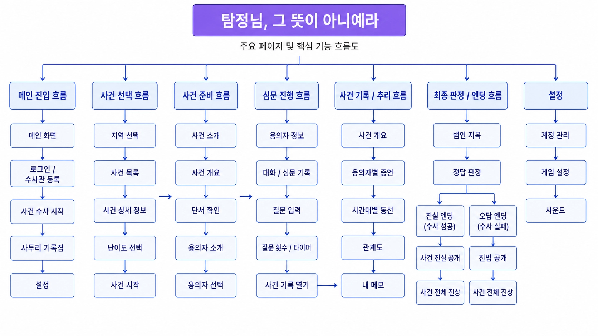

# 화면 설계서

## 화면 흐름



> 메인 진입부터 사건 선택·준비·심문·사건 기록·최종 판정 및 설정까지의 주요 화면 흐름을 정리한 도식이다.

```text
홈 → 로그인/회원가입 → 지역 선택 → 에피소드·난이도 선택
→ 사건 수사 ┬→ 심문
            ├→ 사건 기록
            └→ 최종 추리 → 결과
홈/프로필 → 진행도·이력·사투리 기록·설정
```

동적 게임 경로의 `sessionId` 자리에는 세션 UUID뿐 아니라 에피소드 코드가 사용될 수 있으며, 프론트가 `/api/sessions/resolve/:sessionKey`로 실제 세션을 해석한다.

## 화면 목록

| 화면·경로 | 목적과 주요 행동 | 이동 조건 | 주요 API |
|---|---|---|---|
| 홈 `/` | 수사 시작, 기록·사투리 진입, 로그아웃 | 인증 여부에 따라 로그인 또는 대상 화면 | 인증 상태 |
| 로그인 `/login` | 이메일·비밀번호 로그인 | 성공 시 게임 진입 | `POST /api/auth/sign-in` |
| 회원가입 `/signup` | 계정과 수사관 이름 등록 | 성공 후 인증 상태 반영 | `POST /api/auth/sign-up` |
| 지역 `/regions` | 지역과 공개 사건 선택, 진행 세션 이어하기 | 사건 카드 선택 | `GET /api/regions`, 지역별 episodes, active session |
| 에피소드 `/episodes/[episodeId]` | 사건 개요, 용의자, 난이도 확인과 세션 시작 | 인증 후 시작 성공 | episode detail·difficulties·suspects, `POST /api/sessions` |
| 용의자 공개 정보 `/episodes/[episodeId]/suspects` | 심문 전 공개 프로필 비교 | 사건 개요로 복귀 | episode suspects |
| 사건 수사 `/game/[sessionId]` | 세션 상태, 증거, 용의자, 남은 질문 확인 | 용의자·기록·추리 선택 | session, episode, evidence, suspects |
| 심문 `/game/[sessionId]/interrogation/[suspectId]` | 질문 입력, 최대 3개 증거 제시, 답변·감정·새 단서 확인 | 유효 세션과 용의자 | interrogation GET/POST, evidence |
| 사건 기록 `/game/[sessionId]/records` | 획득 증거·단서·증언·타임라인·관계·메모 확인 | 세션 소유자 | records, clues, evidence, notes |
| 최종 추리 `/game/[sessionId]/deduction` | 용의자 지목과 제출 | 서버가 허용한 세션 상태 | `POST /api/sessions/:id/deduction` |
| 결과 `/game/[sessionId]/result` | 정답·오답 엔딩, 점수, 진상과 보고서 확인 | 제출된 세션 | result, ending, report |
| 프로필 `/profile` | 진행 요약과 하위 기록 메뉴 | 인증 사용자 | progress summary |
| 진행도 `/profile/progress` | 사건별 상태·최고 난이도·점수 확인 | 인증 사용자 | progress episodes |
| 플레이 이력 `/profile/history` | 페이지별 과거 결과와 결과 재열람 | 인증 사용자 | progress history |
| 사투리 `/profile/dialects` | 해금 표현과 표준 의미 확인 | 인증 사용자 | progress dialects |
| 설정 `/settings` | 닉네임, BGM·효과음, 텍스트 속도 변경 | 로그인 시 저장, 비로그인 시 안내 | auth me·settings |

## 상태와 피드백

- 모든 데이터 화면은 로딩, 빈 결과, 재시도 가능한 API 오류 상태를 구분한다.
- 세션 종료·만료·포기 상태에서는 심문이나 추리 행동을 제한하고 결과 또는 사건 목록으로 안내한다.
- 심문 성공 시 서버 응답의 `newlyUnlockedClues`와 `newlyUnlockedEvidence`만 새 항목으로 알린다.
- 기록 화면 재진입과 새로고침은 서버에 저장된 획득 상태를 다시 조회한다.
- BGM과 버튼 효과음은 사용자 설정을 따르며 게임 판정과 독립적이다.
